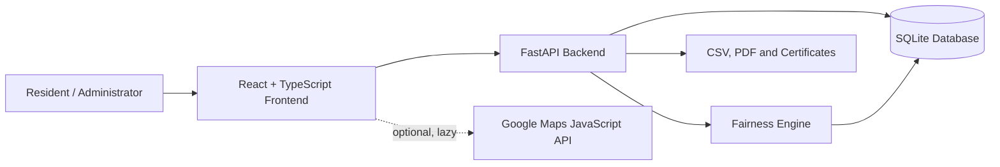
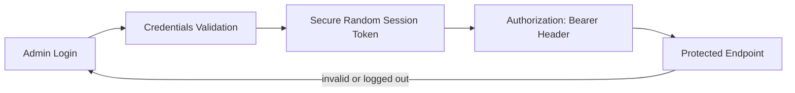
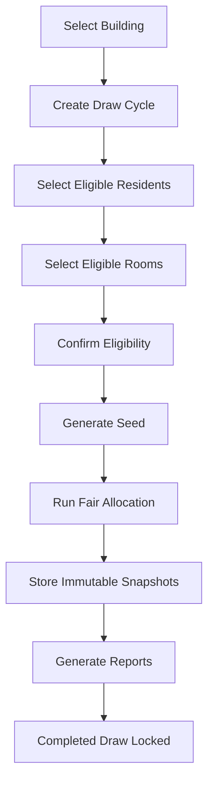
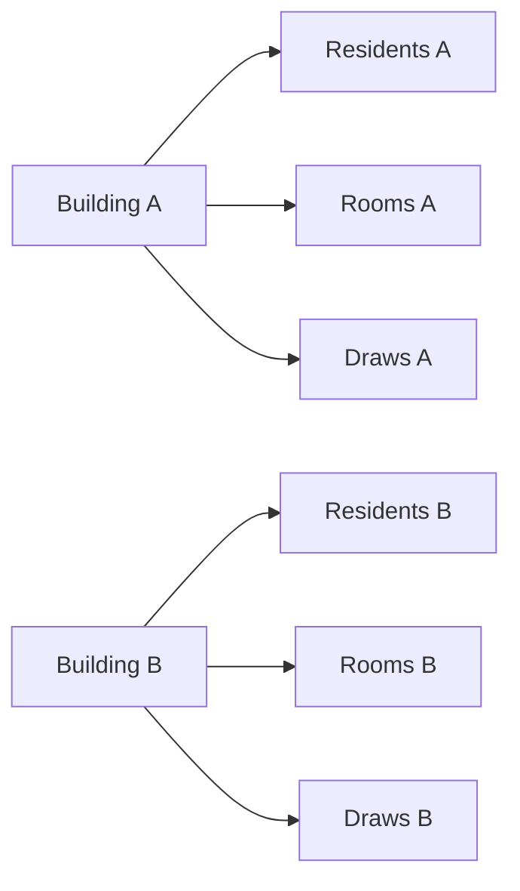

# FairRoom — Intelligent Housing Allocation System: System Architecture

## Components

- **React frontend:** responsive pages rendered inside a shared `Shell`.
- **Protected routes:** the application checks the stored session and returns unauthenticated users to `/admin-login`.
- **BuildingContext:** loads the building list and maintains the selected building across pages.
- **Building map module:** lazy-loads the official Google Maps JavaScript API only for the Dashboard and open Add/Edit map sections, owns one 2D marker/info window and clears them on building changes.
- **API client:** attaches the Bearer token, formats FastAPI errors and handles session expiry.
- **FastAPI backend:** validates requests and exposes public and authenticated endpoints.
- **Authentication layer:** validates local credentials and server-side session tokens.
- **Building-scoped services:** every managed resource is checked against its building.
- **Fairness engine:** performs validation, seeded shuffling, priority grouping, suitability matching and scoring.
- **Reporting module:** creates current reports, CSV files, PDFs and certificates.
- **SQLite:** persists operational state and immutable snapshots.
- **Audit system:** records important administrative and draw actions.
- **Playwright environment:** runs one worker against ports 8010/5174 and a temporary database.
- **Map test adapter:** renders selected-building coordinates deterministically and prevents external Google requests when `VITE_GOOGLE_MAPS_TEST_MODE=true`.

## High-Level Architecture

## Authentication Flow

The token is stored in browser local storage for the demonstration session. The backend keeps the valid token in application settings. Logout invalidates the backend token and removes the browser copy.

## Lottery Flow

## Building Separation

Every building-specific endpoint validates the building and resource relationship. A resident, room or draw belonging to a different building is treated as not found. Room numbers and old-room numbers can therefore repeat across buildings without mixing records.

Map state follows the same selection boundary. `selectedBuildingId` changes clear the old marker and info window before the new dashboard payload is rendered. The map receives only the selected building record. Map loading never blocks building statistics or lottery data. External **Open Maps** and **Directions** actions use standard Google Maps URLs, not the Routes API.

The API key is read only from Vite environment configuration. It is never stored in SQLite or an audit entry. Because Vite browser variables are delivered to the browser, production security depends on Google Cloud API restrictions (Maps JavaScript API only plus exact HTTP referrers), not on treating the browser key as a server secret.

## Data and History Boundaries

Current allocations support operational screens. `draw_allocations` stores historical values such as names, masked identifiers and room details so later edits cannot rewrite the past. Completed draws reject changes. Preparing cycles remain editable; Ready and In Progress cycles lock their participant lists.
