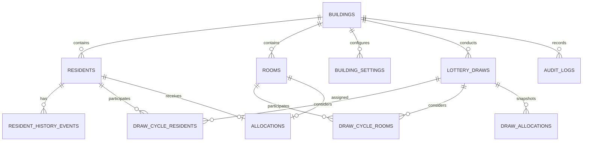

# FairRoom — Intelligent Housing Allocation System: Database Design

SQLite is used for local persistence. Migrations in `backend/app/database.py` are idempotent and preserve existing records.

## Main Tables

| Table | Purpose and important fields |
|---|---|
| `buildings` | Building master. PK `id`; names, project, address, nullable map location, status and archive timestamp. |
| `building_settings` | Per-building lottery/session state. Composite PK `(building_id, key)`; FK to building. |
| `residents` | Building resident records. PK `id`; FK `building_id`; masked Aadhaar, SHA-256 hash, old room, priority, consent and verification. |
| `rooms` | Building room inventory. PK `id`; FK `building_id`; room number, wing, floor, size, status and suitability. |
| `allocations` | Current allocation projection. PK `id`; FKs to building, resident, room and draw; seed, score and explanation. |
| `lottery_draws` | Authoritative draw-cycle record. Draw number/reference/name/phase, status, counts, seed, score, timestamps, reasons and building snapshots. |
| `draw_cycle_residents` | Eligibility record for every resident considered in a cycle, including snapshot and override reason. Unique `(draw_id, resident_id)`. |
| `draw_cycle_rooms` | Eligibility record for every room considered in a cycle and room snapshots. Unique `(draw_id, room_id)`. |
| `draw_allocations` | Immutable completed-draw allocation snapshots, including allocated and unallocated participants. Unique `(draw_id, resident_id)`. |
| `resident_history_events` | Chronological resident events linked optionally to a draw. |
| `audit_logs` | Action, administrator, reason, timestamp and optional building/draw/resident/room links. |
| `settings` | Global application settings, including the current admin session token and email. |
| `society` | Legacy society information retained for compatibility. |

## Uniqueness and Integrity

- Aadhaar/ID hashes are globally unique across buildings.
- Old-room numbers are unique within a building.
- New-room numbers are unique within a building.
- Current `allocations` enforce unique resident and room references.
- Draw numbers are unique per building and draw references are globally unique.
- Historical tables store display snapshots rather than relying only on mutable current rows.

## Building Location Columns

| Column | Type | Meaning |
|---|---|---|
| `latitude` | nullable REAL | WGS84 latitude, validated from -90 to 90. |
| `longitude` | nullable REAL | WGS84 longitude, validated from -180 to 180. |
| `map_zoom` | INTEGER | Preferred 2D zoom, default 17 and validated from 3 to 20. |
| `location_status` | TEXT | `Not Set`, `Located`, `Manual` or `Failed`. |
| `location_updated_at` | nullable TEXT | UTC timestamp of the last location change. |
| `google_place_id` | nullable TEXT | Optional place identifier from a confirmed address result. |

Latitude and longitude are both null or both present. Existing buildings remain valid with null coordinates. `migrate_google_maps()` checks each column before adding it, normalizes safe defaults and is non-destructive, idempotent and restart-safe. A location edit writes a building-scoped `Building Map Location Updated` audit record without any API key.

## ER Diagram

## Historical Immutability

A completed draw retains its building, rules, participant and allocation values. The update endpoint for completed draw history returns HTTP 423. Normal demo reset preserves completed history. A separate backup is created before material production migrations.
